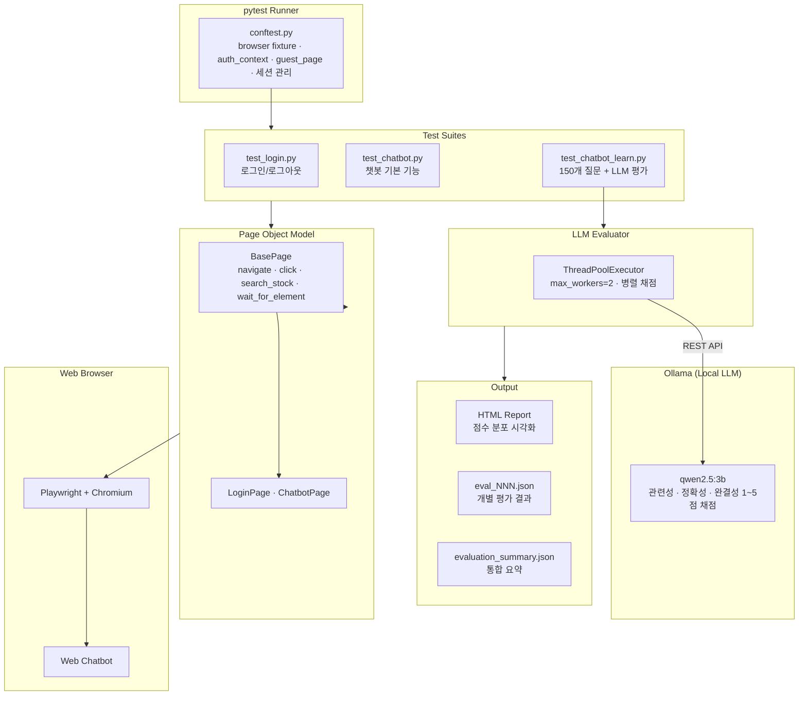

# LLM Judge QA

Python + Playwright 기반의 웹 챗봇 응답 품질 자동 평가 프레임워크.
Page Object Model 패턴을 적용하며, 150개 질문에 대한 챗봇 응답을 **LLM-as-a-Judge** 방식으로 자동 채점합니다.

## 핵심 기술 시연

| 영역 | 구현 내용 |
|------|---------|
| 설계 패턴 | Page Object Model — BasePage 상속, 셀렉터 분리, 재사용 액션 메서드 |
| 기능 테스트 | 로그인, 로그아웃, 챗봇 토글, 메시지 전송 시나리오 검증 |
| LLM 평가 | Ollama(로컬 LLM)를 평가자로 활용, 관련성·정확성·완결성 1~5점 채점 |
| 병렬 처리 | ThreadPoolExecutor(`max_workers=2`)로 응답 수집과 LLM 평가 동시 실행 |
| 스트리밍 대응 | 응답 텍스트 변화 감지 + 안정화 대기 로직으로 WebSocket 스트리밍 처리 |
| 인증 관리 | Playwright `storage_state`를 활용한 세션 저장/복원, 로그인·게스트 컨텍스트 분리 |
| 리포팅 | 점수 분포 시각화 + 상세 평가 근거가 포함된 HTML 리포트 자동 생성 |

## 시스템 아키텍처



**conftest.py**는 browser fixture, 인증 컨텍스트(`auth_context`), 게스트 컨텍스트(`guest_page`), 결과 디렉토리 생성을 담당합니다.

**POM 계층**: BasePage(navigate, click, search_stock, wait_for_element, get_text)를 기반으로 LoginPage, ChatbotPage가 상속됩니다.

## 테스트 스위트 상세

### 기능 테스트 — 로그인

| 테스트 | 시나리오 | 검증 |
|--------|---------|------|
| test_login_page_loads | 페이지 정상 로드 | URL 확인 |
| test_login_button_visible | 비로그인 상태 | 로그인 버튼 표시 |
| test_authenticated_session | 저장된 세션 | 로그인 유지 확인 |
| test_logout | 로그아웃 실행 | 로그아웃 상태 확인 |

### 기능 테스트 — 챗봇 (비로그인)

| 테스트 | 시나리오 | 검증 |
|--------|---------|------|
| test_chatbot_toggle_visible | 토글 버튼 존재 | 버튼 표시 여부 |
| test_chatbot_opens | 패널 열기 | 입력창 표시 확인 |
| test_chatbot_send_message | 메시지 전송 | 응답 수신 확인 |
| test_chatbot_response_relevance | 관련성 확인 | 응답 길이 검증 |

### LLM 품질 평가 — 150개 질문

```
[질문 수집]  150개 질문 순차 전송 → 응답 캡처 → chat_NNN.json 저장
     │
     ▼
[병렬 평가]  ThreadPoolExecutor(max_workers=2) → Ollama 채점
     │
     ▼
[결과 저장]  eval_NNN.json 개별 저장 → evaluation_summary.json 통합
     │
     ▼
[리포트]    generate_report.py → report.html (점수 분포 + 상세 결과)
```

**질문 카테고리** (150개):

| 범위 | 카테고리 | 예시 |
|------|---------|------|
| 1-10 | 기본 인사·서비스 안내 | 안녕하세요, 사용법, 요금제 |
| 11-30 | 주요 종목 질의 | 삼성전자 주가, SK하이닉스 현재가 |
| 31-50 | 재무 지표 | PER, PBR, ROE, EPS 설명 |
| 51-70 | 투자 전략 | 가치투자, 분산투자, ETF |
| 71-90 | 시장 분석 | 코스피 동향, 섹터 전망 |
| 91-110 | 기술적 분석 | 이동평균선, RSI, MACD |
| 111-130 | 경제 기초 | GDP, 기준금리, 양적완화 |
| 131-150 | 심화 질문 | 5년간 매출 추이, 저PBR 고ROE 종목 |

### 평가 기준 (Score Card)

| 점수 | 설명 |
|------|------|
| 5 | 관련성·정확성·완결성 완벽, 구체적이고 유용한 정보 제공 |
| 4 | 대부분 충족하나 설명이 다소 부족 |
| 3 | 관련성은 있으나 정확성 또는 완결성 미흡 |
| 2 | 관련은 있으나 불충분하거나 일부 오류 |
| 1 | 질문과 무관하거나 에러 메시지만 반환 |

## 프로젝트 구조

```
llm-judge-qa/
├── pages/                      # POM (BasePage + 2 page classes)
│   ├── base_page.py            # 공통 navigate, click, search_stock
│   ├── login_page.py           # Google 로그인, 로그아웃, 상태 확인
│   └── chatbot_page.py         # 질문 전송, 스트리밍 응답 대기, 결과 저장
├── tests/                      # 기능 테스트 + LLM 품질 평가
│   ├── test_login.py           # 로그인/로그아웃 시나리오
│   ├── test_chatbot.py         # 챗봇 기본 기능 (비로그인)
│   └── test_chatbot_learn.py   # 150개 질문 + Ollama 품질 평가
├── conftest.py                 # pytest fixtures (인증, 세션 관리)
├── save_auth.py                # 로그인 세션 저장 스크립트
├── generate_report.py          # HTML 리포트 생성
├── requirements.txt
└── .env.example
```

## 로컬 실행

### 선행 요구사항

| 도구 | 확인 | 목적 |
|------|------|------|
| Python 3.11+ | `python --version` | 테스트 실행 |
| Ollama | `ollama --version` | LLM 평가자 |
| Chromium | Playwright 자동 설치 | 브라우저 자동화 |

### 설치

```bash
git clone https://github.com/guswns98/llm-judge-qa-.git
cd llm-judge-qa-

pip install -r requirements.txt
playwright install chromium

# Ollama 모델 다운로드
ollama pull qwen2.5:3b

cp .env.example .env
# .env에 실제 값 입력
```

### 테스트 실행

```bash
# 로그인 세션 저장 (최초 1회)
python save_auth.py

# 전체 테스트
pytest

# LLM 품질 평가 (150개 질문)
pytest tests/test_chatbot_learn.py -s --headed

# 개별 테스트
pytest tests/test_login.py -v
pytest tests/test_chatbot.py -v

# 화면 확인 모드
pytest --headed
```

### 리포트 생성

```bash
python generate_report.py
# → evaluation_results/report.html
```

## 리포트

`evaluation_results/` 디렉토리에 자동 생성:

| 리포트 | 형식 | 내용 |
|--------|------|------|
| HTML Report | report.html | 점수 분포 시각화 + 상세 평가 결과 |
| 개별 평가 | eval_NNN.json | 질문별 점수, 응답, 평가 근거 |
| 통합 요약 | evaluation_summary.json | 평균 점수, 점수 분포, 전체 결과 |
| 챗봇 응답 | chat_results/chat_NNN.json | 원본 질문-응답 쌍 |

## 기술 스택

| 카테고리 | 기술 |
|---------|------|
| 브라우저 자동화 | Playwright |
| 테스트 프레임워크 | pytest |
| 언어 | Python 3.11+ |
| 설계 패턴 | Page Object Model |
| LLM 평가 | Ollama (qwen2.5:3b) |
| 리포팅 | HTML (자체 생성) |
| 인증 | Playwright Storage State |
